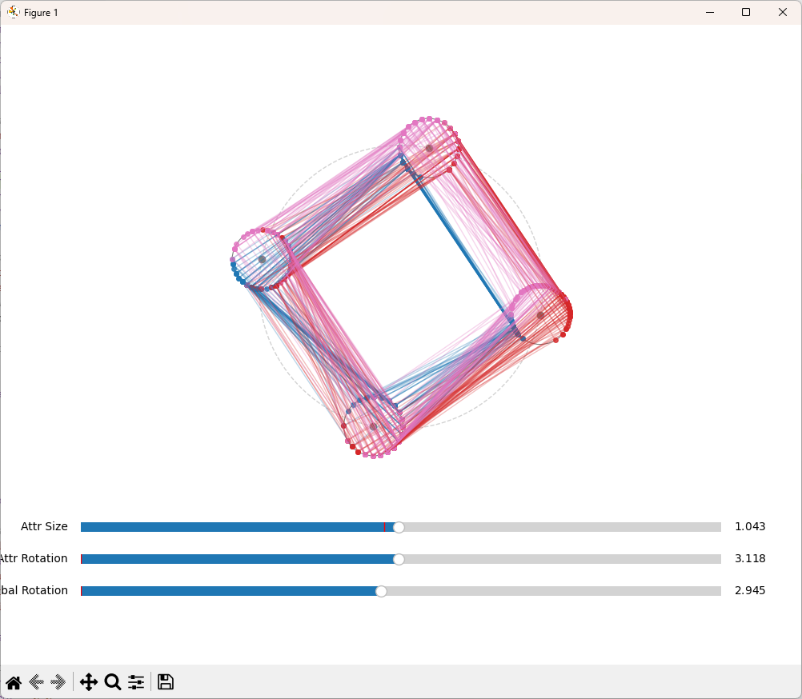

# CircleViz: Radial Attribute Network

CircleViz is a data visualization technique that arranges attributes in a circular network layout, with each attribute represented by its own circle positioned along a main orbit. Data points are visualized on each attribute's circle according to their normalized values and connected with polylines colored by class.



## Key Features

- **Attribute-Centric Layout**: Each attribute gets its own circle positioned around a main orbit
- **Value Mapping**: Data values are mapped to positions on the attribute circles
- **Class Visualization**: Data points are colored by class for easy pattern recognition
- **Interactive Controls**: Adjust attribute circle size, rotation, and global orientation
- **Polyline Connections**: Connected polylines show relationships between attributes for each data point

## How It's Different

Unlike Concentric Coordinates and Circle Coordinates (both Dynamic and Static) which already exist in our repertoire, CircleViz:

- Places each attribute on a separate circle rather than mapping all attributes to a single circle
- Forms a network of attribute circles with polylines showing the data connections
- Allows for dynamic adjustment of the attribute sizing and rotation
- Creates a complete circuit by connecting the last attribute back to the first

## Usage

```python
# Install requirements
pip install -r requirements.txt

# Run the visualization
python test.py
```

By default, the program uses the Fisher Iris dataset. To use your own CSV data:
1. Ensure it has a column named "class"
2. Update the file path in test.py 
